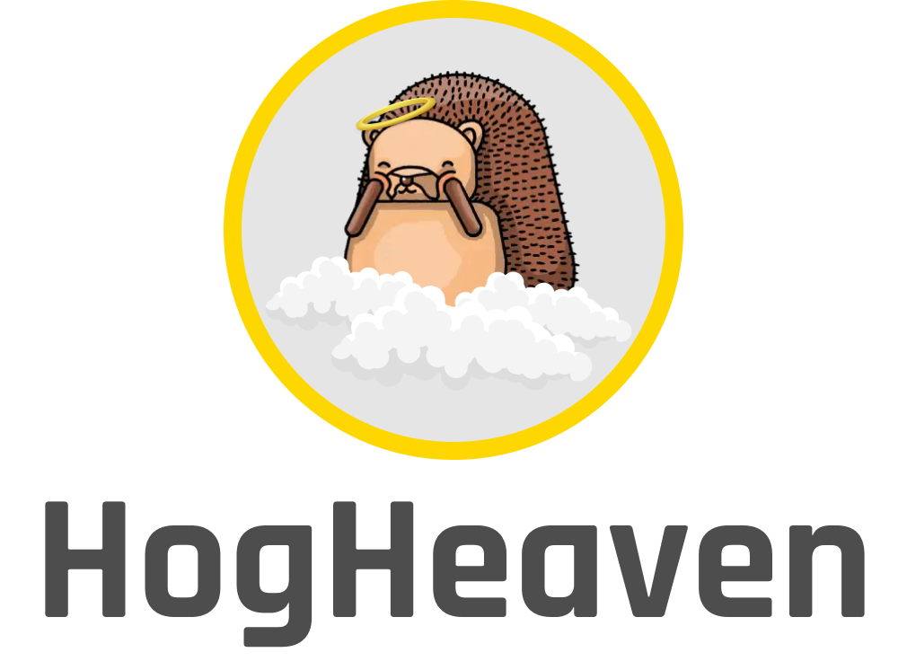

<div>
    <p align="center">
        
    </p>
    <hr>
    <blockquote align="center">
        “Bicycles are the new rollerblades, talentless is the new talented, and I’m in hog heaven.” - Ryan Seacrest
    </blockquote>
</div>

<br>

<p align="center">
  <a href="https://github.com/joggrdocs/hog-heaven/actions/workflows/github-code-scanning/codeql">
    
  </a>
  <a href="https://github.com/joggrdocs/tempo/actions/workflows/ci.yaml">
    
  </a>
  <br/>
  <a href="https://github.com/standard/semistandard">
    
  </a>
  <a href="https://github.com/prettier/prettier">
    
  </a>
</p>

# Overview

Github action for sending release annotations to PostHog, aka make sure your PostHog cloud is in "Hog Heaven".

## Usage

```yaml

```
